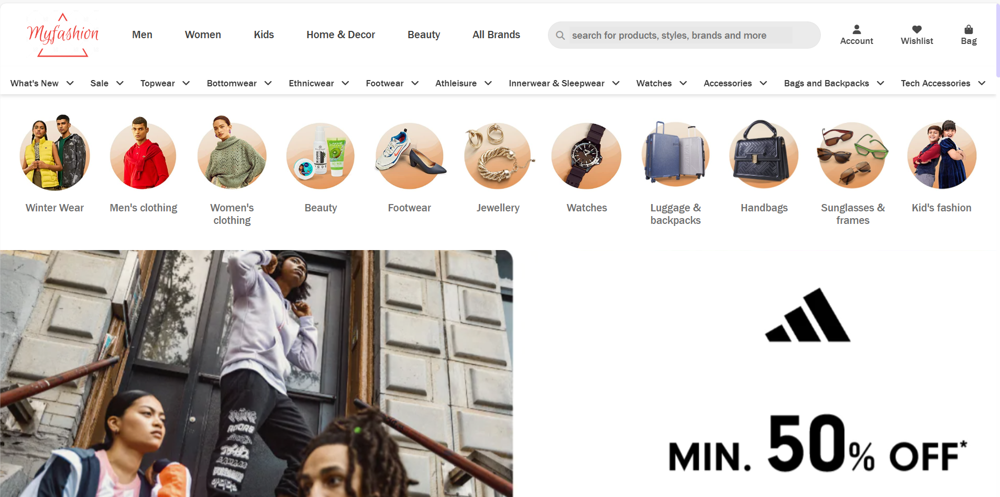
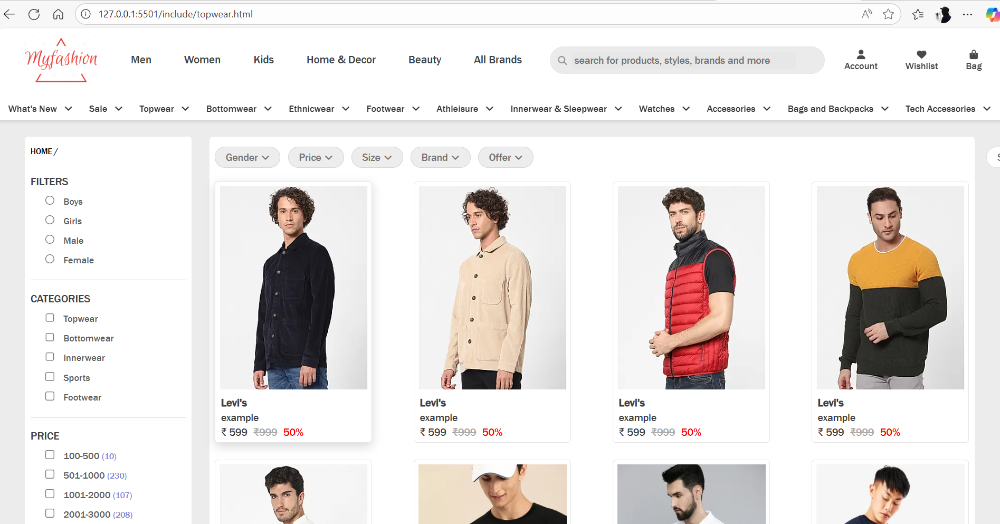
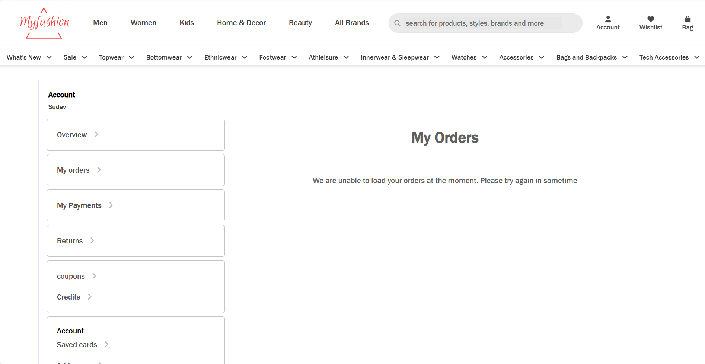
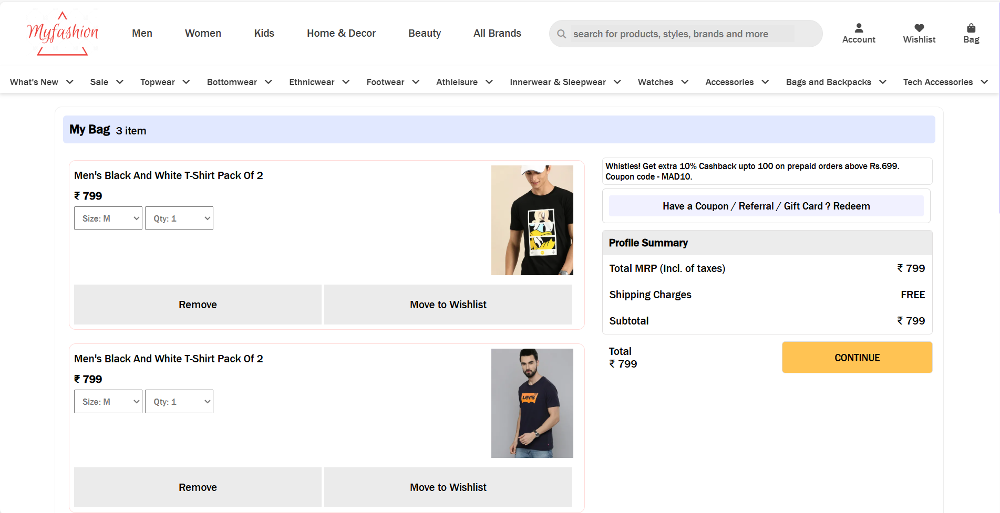

# Fashion ECommerce Website 👗✨

This is a **static website** project built with **HTML, CSS, Bootstrap, and JavaScript**.  
Currently, it serves as the front-end layout for a fashion-related platform.

## 🚀 Features (Current)
- Responsive design using **Bootstrap**
- Styled with **CSS**
- Basic interactivity with **JavaScript**

## 🛠️ Planned Enhancements
In future updates, this project will integrate:
- **React.js** → For a more dynamic and component-based frontend  
- **Node.js** → For backend support and APIs  
- **Database support** (TBD) → For storing user and product data  

## 📸 Screenshots

### 🏠 Home Page

### 👕 Topwear Page

### 📦 My Profile Page

### 🛒 Bag Page

